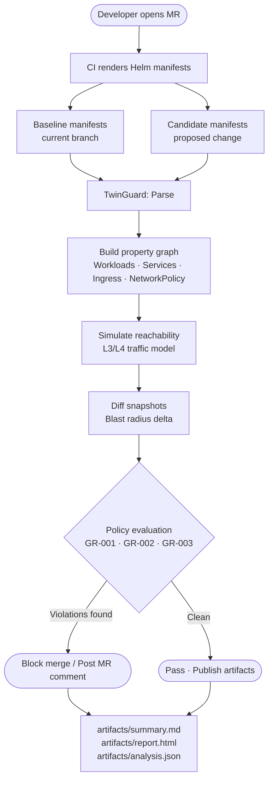

# TwinGuard — Business Value & Architecture

> **Simulate before you ship.** TwinGuard is a Kubernetes-first infrastructure digital twin that catches network policy violations and blast-radius regressions before a merge request ever reaches production.

---

## The Problem

Every infrastructure change carries hidden risk. A one-line Helm values change can:

- Expose a database to the public internet
- Create a wildcard egress hole in a production namespace
- Quietly allow cross-namespace traffic that violates compliance policy

Traditional CI catches syntax errors. It does not catch **semantic security regressions** — the kind that cause incidents.

---

## What TwinGuard Does

TwinGuard builds a **digital twin** of your Kubernetes environment from rendered manifests, simulates the network reachability of every proposed change, and enforces golden-rule policies — all in CI, before merge.



---

## Architecture

```
┌─────────────────────────────────────────────────────┐
│                   TwinGuard Engine                  │
│                                                     │
│  parse.ts        graph.ts         simulate.ts       │
│  ┌──────────┐   ┌────────────┐   ┌──────────────┐  │
│  │ YAML →   │──▶│ Property   │──▶│ Reachability │  │
│  │ K8s      │   │ Graph      │   │ Model        │  │
│  │ Manifest │   │ Workloads  │   │ (L3/L4)      │  │
│  └──────────┘   │ Services   │   └──────┬───────┘  │
│                 │ Ingress    │          │           │
│                 │ NetPolicy  │   diff.ts▼           │
│                 └────────────┘   ┌──────────────┐  │
│                                  │ Snapshot diff │  │
│  policy/index.ts                 │ Blast radius  │  │
│  ┌──────────────────────┐        └──────┬───────┘  │
│  │ GR-001 No public→data│               │           │
│  │ GR-002 No cross-ns   │◀──────────────┘           │
│  │ GR-003 No wildcard   │                           │
│  │        egress/prod   │──▶ Violations[]           │
│  └──────────────────────┘                           │
│                                                     │
│  report.ts: summary.md · report.html · analysis.json│
└─────────────────────────────────────────────────────┘
```

---

## Golden Rules (Policy Pack)

| Rule | ID | Severity | What it catches |
|------|----|----------|-----------------|
| No public ingress to `tier=data` | GR-001 | HIGH | Database or store directly exposed via Ingress |
| No cross-namespace traffic unless allowlisted | GR-002 | MEDIUM | Implicit lateral movement between namespaces |
| No wildcard egress (`0.0.0.0/0`) in `prod` | GR-003 | HIGH | Unrestricted outbound from production pods |

---

## Business Value

### 1. Shift Security Left — Pre-Merge, Not Post-Incident

TwinGuard moves policy enforcement from "discovered in production" to "blocked at merge request." The cost of fixing a misconfiguration drops by **10–100×** when caught before it ships.

### 2. Blast Radius Visibility

Every analysis produces a diff of reachability edges — not just "did the YAML change" but "which workloads can now reach which other workloads." This gives engineers and reviewers a concrete answer to *"what is the actual security impact of this change?"*

### 3. Compliance Without Toil

Golden rules encode your security policy once. Every merge request is automatically evaluated. Compliance evidence (`analysis.json`) is produced as a CI artifact with every run — audit-ready without manual review.

### 4. No Cluster Required

TwinGuard operates entirely on rendered manifests. It does not connect to a live cluster. This means:
- Zero production access risk
- Works in air-gapped environments
- Fast: typical analysis completes in under 2 seconds

### 5. Extensible Policy Engine

The policy pack is just TypeScript. Adding a new rule is adding a new object that implements `PolicyRule.evaluate()`. Teams can encode domain-specific compliance requirements alongside the core golden rules.

---

## ROI Snapshot

| Scenario | Without TwinGuard | With TwinGuard |
|----------|------------------|----------------|
| DB exposed via Ingress | Discovered in prod incident | Blocked at MR — pre-merge |
| Wildcard egress in prod | Detected in next pen test | Blocked at MR — pre-merge |
| Cross-ns lateral movement | Audit finding (remediation cost high) | Policy violation — CI artifact |
| Compliance evidence | Manual review per quarter | Auto-generated every MR |

---

## Artifacts Produced Per Run

| File | Format | Used for |
|------|--------|----------|
| `artifacts/analysis.json` | JSON | Machine-readable, audit archive, downstream tools |
| `artifacts/summary.md` | Markdown | GitLab MR comment (posted by CI) |
| `artifacts/report.html` | HTML | Visual walkthrough, stakeholder demo |

---

## Roadmap

- [ ] NL intent input ("allow frontend→api") mapped to structured assertions
- [ ] Expanded policy pack (mTLS enforcement, resource limits, privileged containers)
- [ ] Multi-cluster graph federation
- [ ] SARIF output for GitLab Security Dashboard integration
- [ ] Policy-as-code DSL for non-TypeScript teams
